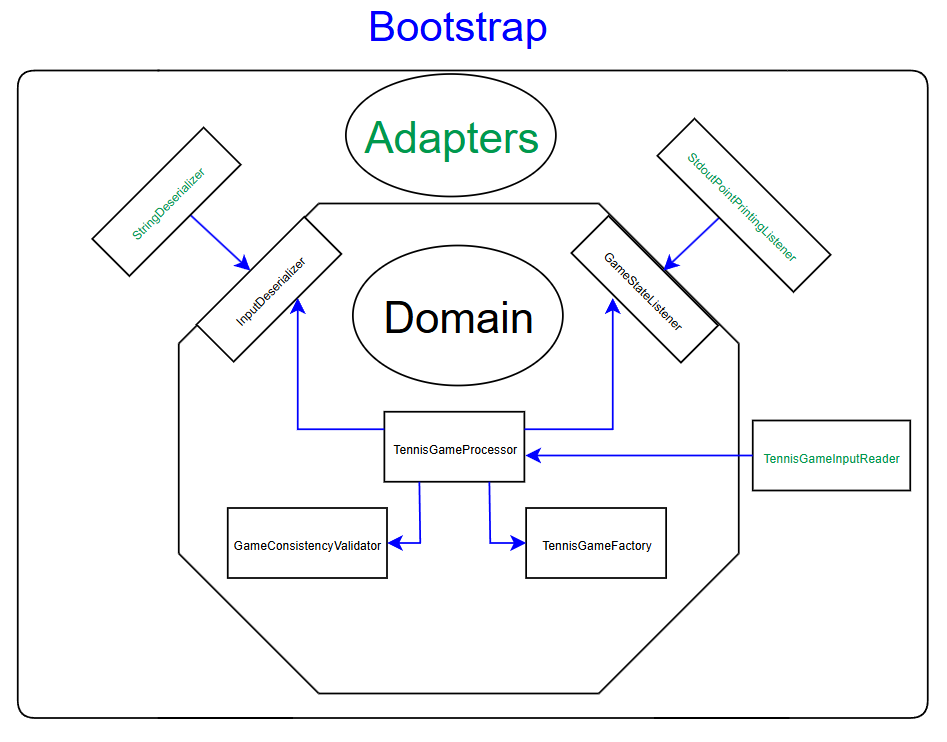

# Tennis Game Printer

[](https://github.com/Bryan-Correia/TennisGamePrinter/actions/workflows/maven.yml)
[](https://sonarcloud.io/component_measures?id=Bryan-Correia_TennisGamePrinter)
[](https://sonarcloud.io/component_measures?id=Bryan-Correia_TennisGamePrinter)
[](https://sonarcloud.io/component_measures?id=Bryan-Correia_TennisGamePrinter)
[](https://sonarcloud.io/component_measures?id=Bryan-Correia_TennisGamePrinter)

This repository contains a tennis game printing application that allows the end-user to have a detailed explanation of a tennis game. 

The input of the application consists in a tennis game between two players named **A** and **B**. 
The input is a string that represents the sequence of each point's winner. 

For instance, passing the string `AAABA` would result in the following output :
```
Player A : 15 / Player B : 0
Player A : 30 / Player B : 0
Player A : 40 / Player B : 0
Player A : 40 / Player B : 15
Player A wins the game
```

Upon running the application, the end-user is prompted to enter a tennis game represented as the aforementioned string.
The user can enter as many strings as he wants, and can leave the program at anytime by typing `exit`.

Should the provided tennis game not be consistent (not enough, or too many points to actually end the game, unknown players...),
a meaningful message is shown :
```
> ABB
The provided tennis game is inconsistent as it showcased less points than needed to end the game.
```

# Prerequisites

Ensure you have the following installed:
- **Java 21** (Check with `java -version`)
- **Maven 3.9.6** (Check with `mvn -version`)

# Architecture

The application's architecture follows the hexagonal architecture pattern. It thus consists in three modules :
* domain
* adapters
* bootstrap



## Domain module

The domain module contains the domain of the application. It has no dependencies whatsoever (except on testing frameworks),
and consists in components that represent what we expect from a tennis game. It has no knowledge of the input format actually required
by our application. It doesn't have any knowledge of printing tennis games either.

Overall, this module simply allows deserializing an input of an unknown type into a collection of tennis points that identify players with
another unknown type as well. Then, it simulates the actual tennis game logic and notifies a listener of each point's outcome.

To do so, it exposes two interfaces referred to as *ports* by the hexagonal architecture principle. These two interfaces, or *ports*, are :
* **InputDeserializer** : takes an input of type < I > and produces a collection of tennis points. Each tennis point identifies a winning player of type < P >.
* **GameStateListener** : gets notified of every point outcome, that is, either a regular, an advantage, a deuce, or a victory point.

## Adapters module

The adapters module contains the implementations of the *ports* defined in the domain layer. Mainly, it contains :

* **StringDeserializer** : an implementation of an *InputDeserializer* that simply deserializes a string into a collection of points that each carry a winner identified
by a character.
* **StdoutPointPrintingListener** : an implementation of a *GameStateListener* that simply prints in the standard output each point.

It also contains a *TennisGameInputReader* that will read the end-user's input, and it is the only component that specifies
players to be identified as **A** and **B**.

The implementations of *ports* found in this module are the ones that define the type of the input as well as the type that identifies each player.
This means that if we were to process any other type of input than a string, let's say some structured json data, then all we need to do is write a dedicated 
implementation of an *InputDeserializer* that takes json data instead. Our domain will not care and will still be able to simulate the tennis game all the same.

## Bootstrap module

The bootstrap module contains the entrypoint of our application, but more importantly, it bootstraps our application.

The bootstrap of the application is handled through Spring which autowires all our components together. This module is thus
the only one to have dependencies on the Spring framework.

# Building and running the application

To build an uber .jar that allows to run the application, you may simply run, from the project's root :
```
mvn package -DskipTests
```

then from the `bootstrap/target` directory, you may simply run :
```
java -jar .\bootstrap-1.0-SNAPSHOT.jar
```

the application will then prompt for input :
```
Tennis Game Printer started. Type 'exit' to quit.
>
```

and you may input as many tennis games as you want : 
```
> AAABBBABBAAA
Player A : 15 / Player B : 0
Player A : 30 / Player B : 0
Player A : 40 / Player B : 0
Player A : 40 / Player B : 15
Player A : 40 / Player B : 30
Deuce
Player A has advantage
Deuce
Player B has advantage
Deuce
Player A has advantage
Player A wins the game
>
```

and you may quit by simply entering `exit` :
```
> exit
Exiting Tennis Game Printer...
```